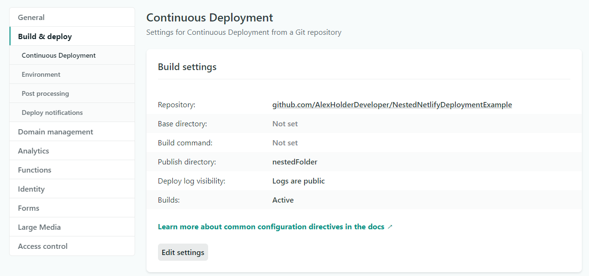

# NestedNetlifyDeploymentExample

This tutorial assumes that you already have a Github repository linked to your Netlify website. Doesn't have to work, just has to be linked!

It's common for students to use one repository per assignment project. To keep things tidy it's also common to have folders upon folders & files tucked away neatly. This is not good for Netlify, unless you know how to edit some Netlify settings to point to the specific folder containing your website files.

As an example, you might have a project with a structure like this:

- root
    - readme.md
    - docs
    - src
        - index.html
    - ppt

By default, Netlify tries to build a website out of the root of your repository. If you want to use a subfolder's contents as your Netlify website, you need to edit one setting in the Netlify website that is linked to your repository.

Go to your Netlify project's 'Continuous Deployment' settings. Your URL sould look something like this:
`https://app.netlify.com/sites/{YOUR NETLIFY WEBSITE NAME HERE}/settings/deploys#continuous-deployment`

In the "Build settings" block on the page, we want to edit the "Publish directory" so that it points to whatever nested folder is holding all of your actual website files & folders & etc.

In this repository, the website is contained in a folder named "nestedFolder".

This means my "Publish directory" must have a value of "nestedFolder".

It should look something like this to work:

Once that property has been edited & saved, enjoy your awesome deployed website!
